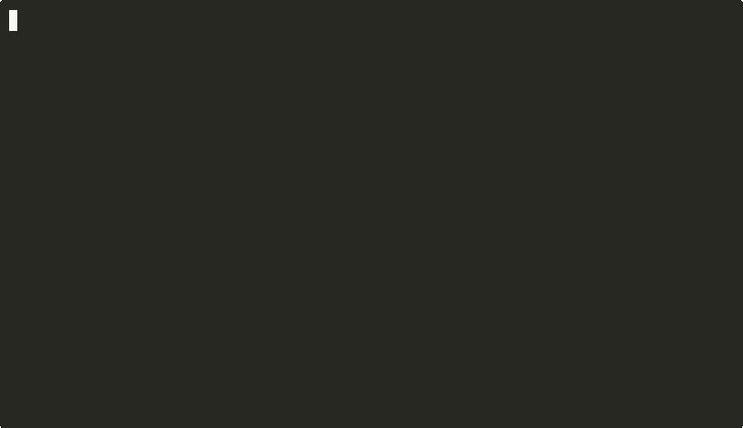

# moss


[](https://webchat.oftc.net/?nick=&channels=%23moss)



**moss** is a Unix-like, Linux-compatible kernel written in Rust and Aarch64
assembly.

It features a modern, asynchronous core, a modular architecture abstraction
layer, and binary compatibility with Linux userspace applications (currently
capable of running most BusyBox commands).

## Features

### Architecture & Memory
* Full support for aarch64.
* A well-defined HAL allowing for easy porting to other architectures (e.g.,
  x86_64, RISC-V).
* Memory Management:
    * Full MMU enablement and page table management.
    * Copy-on-Write (CoW) pages.
    * Safe copy to/from userspace async functions.
    * Kernel and userspace page fault management.
    * Buddy allocator for physical addresses and `smalloc` for boot allocations
      and tracking memory reservations.

### Async Core
One of the defining features of `moss` is its usage of Rust's `async/await`
model within the kernel context:
* All non-trivial system calls are written as `async` functions, sleep-able
  functions are prefixed with `.await`.
* The compiler enforces that spinlocks cannot be held over sleep points,
  eliminating a common class of kernel deadlocks.

### Process Management
* Full task management including both UP and SMP scheduling via EEVDF and task migration via IPIs.
* Currently implements [85 Linux syscalls](./etc/syscalls_linux_aarch64.md); sufficient to execute most BusyBox
  commands.
* Advanced forking capabilities via `clone()`.
* Process and thread signal delivery and raising support.
* Dynamic ELF binary loading with support for shared libraries.

### VFS & Filesystems
* Virtual File System with full async abstractions.
* Drivers:
    * Ramdisk block device implementation.
    * FAT32 filesystem driver (ro).
    * Ext2/3/4 filesystem driver (ro).
    * `devfs` driver for kernel character device access.
    * `tmpfs` driver for temporary file storage in RAM (rw).
    * `procfs` driver for process and kernel information exposure.

## `libkernel` & Testing
`moss` is built on top of `libkernel`, a utility library designed to be
architecture-agnostic. This allows logic to be tested on a host machine (e.g.,
x86) before running on bare metal.

* Address Types: Strong typing for `VA` (Virtual), `PA` (Physical), and `UA`
  (User) addresses.
* Containers: `VMA` management, generic page-based ring buffer (`kbuf`), and
  waker sets.
* Sync Primitives: `spinlock`, `mutex`, `condvar`, `per_cpu`.
* Test Suite: A comprehensive suite of 230+ tests ensuring functionality across
  architectures (e.g., validating Aarch64 page table parsing logic on an x86
  host).
* Userspace Testing: A dedicated userspace test-suite to validate syscall behavior.

## Building and Running

### Prerequisites
You will need QEMU for aarch64 emulation, dosfstools and mtools to create the
virtual file system.

```bash
sudo apt install qemu-system-aarch64 dosfstools mtools
```

Additionally you will need a version of the [aarch64-none-elf](https://developer.arm.com/Tools%20and%20Software/GNU%20Toolchain) toolchain installed.

#### Any X86-64 Linux OS
To install aarch64-none-elf on any os, download the correct release of `aarch64-none-elf` onto your computer, unpack it, then export the `bin` folder to path (Can be done via running

`export PATH="~/Downloads/arm-gnu-toolchain-X.X.relX-x86_64-aarch64-none-elf/bin:$PATH"`, X is the version number you downloaded onto your machine.

in your terminal.)

#### macOS
There is experimental support for macOS in the scripts/mac-experimental folder. The scripts in there are not guaranteed to work for all macOS users and has only been tested on an M4 Apple Silicon MacBook Air.

#### NixOS

Run the following command

```bash
nix shell nixpkgs#pkgsCross.aarch64-embedded.stdenv.cc nixpkgs#pkgsCross.aarch64-embedded.stdenv.cc.bintools
```

### Preparing the image

First, run the following script to prepare the binaries for the image:
```bash
./scripts/build-deps.sh
```

This will download and build the necessary dependencies for the kernel and put them
into the `build` directory.

Once that is done, you can create the image using the following command:
```bash
./scripts/create-image.sh
```

This will create an image file named `moss.img` in the root directory of the
project, format it as ext4 image and create the necessary files and directories for
the kernel.

### Running via QEMU

To build the kernel and launch it in QEMU:

``` bash
cargo run --release
```


### Running the Test Suite
Because `libkernel` is architecturally decoupled, you can run the logic tests on
your host machine:

``` bash
cargo test -p libkernel --target x86_64-unknown-linux-gnu
```


### Roadmap & Status

moss is under active development. Current focus areas include:

* Basic Linux Syscall Compatibility (Testing through BusyBox).
* Networking Stack: TCP/IP implementation.
* Scheduler Improvements: Task load balancing.
* A fully read/write capable filesystem driver.
* Expanding coverage beyond the current 85 calls.

## Contributing

Contributions are welcome! Whether you are interested in writing a driver,
porting to x86, or adding syscalls.

## License
Distributed under the MIT License. See LICENSE for more information.
